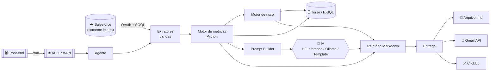
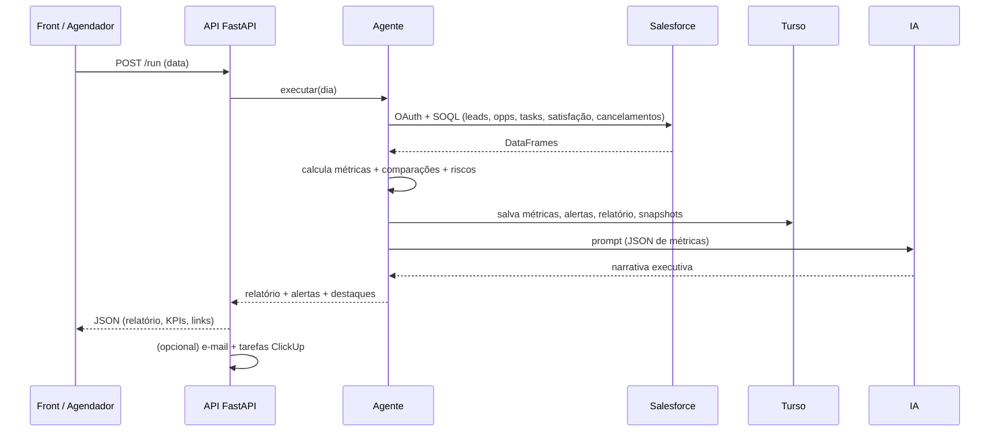

<!--
O bloco acima (entre ---) é o metadata exigido pelo Hugging Face Spaces.
Não remova ao publicar no HF. Em deploy Docker, a API escuta na porta 7860.
-->

<div align="center">

# 📊 Analytical-Force

### Agente de inteligência analítica que transforma dados do Salesforce em diagnóstico executivo diário, alertas de risco e ações recomendadas.

<br/>


</div>

---

## 🧭 Índice

- [Visão geral](#-visão-geral)
- [Arquitetura](#-arquitetura)
- [Fluxo diário](#-fluxo-diário)
- [Stack](#-stack)
- [Estrutura do projeto](#-estrutura-do-projeto)
- [Configuração (.env)](#-configuração-env)
- [Guia de replicação](#-guia-de-replicação)
  - [1. Salesforce (OAuth)](#1--salesforce-oauth-refresh-token)
  - [2. Turso](#2--turso--banco)
  - [3. IA (Hugging Face Inference)](#3--ia--hugging-face-inference)
  - [4. Gmail API (e-mail)](#4--gmail-api-e-mail)
  - [5. ClickUp (tarefas)](#5--clickup-tarefas)
- [Como rodar (local)](#-como-rodar-local)
- [Deploy online (Hugging Face Spaces)](#-deploy-online-hugging-face-spaces)
- [API](#-api)
- [Front-end](#-front-end)
- [Banco de dados](#-banco-de-dados)
- [Segurança](#-segurança)
- [Desenvolvedor](#-desenvolvedor)

---

## 🎯 Visão geral

O **Analytical-Force** roda diariamente e analisa **leads, oportunidades, tarefas,
satisfação e cancelamentos**, comparando com o dia anterior e a média dos últimos
7 dias. Ele gera **alertas de risco**, **prioridades do dia** e um **relatório
executivo** — entregue por arquivo, e-mail e ClickUp.

> ### Princípio central
> **Python calcula. · IA interpreta. · Turso armazena. · Salesforce fornece os dados.**
>
> A IA **nunca** calcula indicadores — recebe apenas um JSON com métricas já
> prontas e produz a narrativa. O Salesforce opera em **modo somente leitura**.

| Recurso | Descrição |
| ------- | --------- |
| 🔐 Autenticação | Salesforce via **OAuth Refresh Token** (somente leitura) |
| 📈 Métricas | Leads, oportunidades, tarefas, satisfação, cancelamentos + variações |
| 🚨 Motor de risco | Alertas `low` / `medium` / `high` com ação recomendada |
| 🤖 IA | Narrativa executiva (Hugging Face Inference, Ollama local ou template) |
| 🗄️ Persistência | Turso/libSQL (métricas, alertas, relatórios, snapshots) |
| 📬 Entrega | Arquivo `.md`, e-mail (Gmail API) e tarefas no ClickUp |
| 🌐 API + Front | FastAPI + painel HTML para acionar e visualizar |

---

## 🏗️ Arquitetura



---

## 🔄 Fluxo diário



---

## 🧰 Stack

| Camada | Tecnologia |
| ------ | ---------- |
| Linguagem | Python 3.11+ |
| Salesforce | `simple-salesforce` + OAuth 2.0 |
| Dados | `pandas` |
| Banco | **Turso / libSQL** (`libsql`) |
| IA | Hugging Face Inference · Ollama (local) · Transformers · Template |
| API | **FastAPI** + Uvicorn |
| Entrega | Gmail API · SMTP · ClickUp API |
| Deploy | **Docker** / Hugging Face Spaces |
| Front | HTML + Chart.js + marked (single-file) |

---

## 📁 Estrutura do projeto

```
analytical-force/
├── api.py                 # API FastAPI (deploy online)
├── main.py                # CLI
├── frontend.html          # Painel web (single-file)
├── Dockerfile             # Imagem para HF Spaces
├── requirements.txt       # Deps (local)
├── requirements-hf.txt    # Deps enxutas (Space)
├── .env.example           # Modelo de variáveis (sem segredos)
├── scripts/
│   ├── test_salesforce_oauth.py   # valida OAuth Salesforce
│   ├── test_gmail_oauth.py        # valida Gmail API
│   └── clean_db.py                # limpeza do Turso
└── src/
    ├── config/      # settings (variáveis de ambiente)
    ├── database/    # turso_client, migrations, repositories
    ├── salesforce/  # client (OAuth), queries, extractors, field_mapping
    ├── analytics/   # métricas + motor de risco
    ├── models/      # hf_inference, ollama, transformers, template, router
    ├── agent/       # orquestrador, prompt_builder, report_generator
    ├── delivery/    # file_writer, email_sender (Gmail/SMTP), clickup_sender
    └── utils/       # logger, date_utils, validators
```

---

## ⚙️ Configuração (.env)

Copie `.env.example` para `.env` e preencha. **Nunca** faça commit do `.env`.

| Variável | Descrição |
| -------- | --------- |
| `SALESFORCE_AUTH_MODE` | `oauth_refresh_token` (padrão) ou `soap_legacy` |
| `SALESFORCE_INSTANCE_URL` | URL da org (ex.: `https://suaorg.my.salesforce.com`) |
| `SALESFORCE_CLIENT_ID` / `SALESFORCE_CLIENT_SECRET` | Connected App |
| `SALESFORCE_REFRESH_TOKEN` | Refresh token OAuth |
| `SALESFORCE_API_VERSION` | ex.: `64.0` |
| `TURSO_DATABASE_URL` / `TURSO_AUTH_TOKEN` | Banco libSQL/Turso |
| `MODEL_PROVIDER` | `hf_inference` · `ollama` · `transformers` · `template` |
| `HF_INFERENCE_MODEL` / `HF_TOKEN` | IA hospedada (ex.: `Qwen/Qwen2.5-7B-Instruct`) |
| `GMAIL_CLIENT_ID/SECRET/REFRESH_TOKEN/SENDER` | Envio por Gmail API |
| `CLICKUP_API_TOKEN` / `CLICKUP_LIST_ID` / `CLICKUP_ASSIGNEE_ID` | Tarefas |
| `OPPORTUNITY_MIN_AMOUNT` | Valor mínimo de oportunidade a analisar |

> A lista completa e comentada está em [`.env.example`](.env.example).

---

## 🧩 Guia de replicação

### 1.  Salesforce (OAuth Refresh Token)

1. **Setup → App Manager → New Connected App.**
2. Ative **Enable OAuth Settings**. Callback URL: `https://login.salesforce.com/services/oauth2/callback`.
3. Scopes (OAuth): **`Manage user data via APIs (api)`** e **`Perform requests at any time (refresh_token, offline_access)`**.
4. Salve e copie **Consumer Key** (`CLIENT_ID`) e **Consumer Secret** (`CLIENT_SECRET`).
5. Gere o **Refresh Token** (fluxo OAuth web). Coloque tudo no `.env`.
6. Valide:

   ```bash
   python scripts/test_salesforce_oauth.py
   ```

> 💡 Recomendado um **usuário de integração com perfil somente leitura**. O agente
> só executa `SELECT` (SOQL); nenhuma operação de escrita é implementada.

### 2.  Turso — banco

```bash
turso db create analytical-force
turso db show analytical-force --url       # -> TURSO_DATABASE_URL (libsql://...)
turso db tokens create analytical-force    # -> TURSO_AUTH_TOKEN
```

As tabelas são criadas automaticamente (migrations idempotentes) na 1ª execução.

### 3.  IA — Hugging Face Inference

1. Crie um token em **huggingface.co/settings/tokens** com permissão **Make calls to Inference Providers**.
2. No `.env`: `MODEL_PROVIDER=hf_inference`, `HF_INFERENCE_MODEL=Qwen/Qwen2.5-7B-Instruct`, `HF_TOKEN=...`.

> Alternativas: `ollama` (modelo local), `transformers` (modelo público em CPU) ou
> `template` (sem IA — números idênticos, narrativa por regras, instantâneo).

### 4.  Gmail API (e-mail)

> O HF Spaces bloqueia SMTP — por isso o e-mail online usa a **Gmail API (HTTP)**.

1. Google Cloud Console → ative a **Gmail API**.
2. Tela de consentimento OAuth (**External**) → adicione seu e-mail em **Test users**.
3. Crie credencial **OAuth Client (Web)** com redirect `https://developers.google.com/oauthplayground`.
4. No **OAuth Playground**, autorize o escopo `https://www.googleapis.com/auth/gmail.send` e gere o **refresh token**.
5. No `.env`: `GMAIL_CLIENT_ID/SECRET/REFRESH_TOKEN` + `GMAIL_SENDER` + `REPORT_RECIPIENT_EMAIL`.
6. Valide:

   ```bash
   python scripts/test_gmail_oauth.py
   ```

### 5.  ClickUp (tarefas)

1. ClickUp → **Settings → Apps → API Token** (`pk_...`).
2. Pegue o **List ID** pela URL da lista: `app.clickup.com/.../li/<LIST_ID>`.
3. No `.env`: `CLICKUP_API_TOKEN`, `CLICKUP_LIST_ID`, `CLICKUP_ASSIGNEE_ID` e `ENABLE_CLICKUP_AUTO_CREATE=true`.

---

## ▶️ Como rodar (local)

```bash
python -m venv .venv && source .venv/bin/activate   # Windows: .venv\Scripts\activate
pip install -r requirements.txt
cp .env.example .env                                 # preencha

python main.py --check          # valida configuração
python main.py --date 2026-06-22 # executa o pipeline real
uvicorn api:app --port 7860      # sobe a API (http://localhost:7860/docs)
```

Abra o **`frontend.html`** no navegador e aponte para a URL da API (na engrenagem ⚙️).

---

## 🚀 Deploy online (Hugging Face Spaces)

Space do tipo **Docker** (build leve, sem torch). Em **Settings → Variables and secrets**:

| Secrets | Variables |
| ------- | --------- |
| `SALESFORCE_CLIENT_ID/SECRET/REFRESH_TOKEN` | `SALESFORCE_AUTH_MODE=oauth_refresh_token` |
| `TURSO_AUTH_TOKEN` | `SALESFORCE_INSTANCE_URL`, `SALESFORCE_API_VERSION=64.0` |
| `HF_TOKEN` | `TURSO_DATABASE_URL`, `MODEL_PROVIDER=hf_inference` |
| `GMAIL_*`, `CLICKUP_API_TOKEN` | `HF_INFERENCE_MODEL`, `CLICKUP_LIST_ID`, etc. |
| `APP_API_TOKEN` (protege o `/run`) | |

---

## 🌐 API

| Método | Rota | Descrição |
| ------ | ---- | --------- |
| GET | `/health` | Verificação de saúde |
| GET | `/config/check` | Validação da configuração (sem segredos) |
| POST | `/run` | Executa o pipeline (corpo JSON) |
| GET | `/run?date=YYYY-MM-DD` | Executa pelo navegador |
| GET | `/metrics/{data}` | Métricas salvas de um dia (rápido) |
| GET | `/history?days=7` | Série histórica para gráficos |
| GET | `/docs` | Swagger |

Autenticação por header `X-API-Key` quando `APP_API_TOKEN` está definido.

---

## 🖥️ Front-end

`frontend.html` é um painel single-file (HTML + Chart.js + marked):
tema claro/escuro, KPIs animados, filtro de alertas, gráfico de severidade,
**Registros do dia** com links diretos ao Salesforce, **Tendências** (gráfico
histórico do Turso), relatório em abas e histórico de execuções.

---

## 🗄️ Banco de dados

Tabelas (Turso/libSQL): `agent_runs`, `daily_metrics`, `daily_alerts`,
`daily_reports`, `salesforce_snapshots`, `object_mapping`, `agent_config`.
As gravações por dia são **idempotentes** (não acumulam ao reexecutar).
Manutenção: `python scripts/clean_db.py --snapshots`.

---

## 🔒 Segurança

- Sem segredos no código — apenas em `.env` (gitignored) ou Secrets do Space.
- Salesforce **somente leitura** (apenas SOQL `SELECT`).
- Logs mascaram senhas/tokens.
- `/run` protegível por `APP_API_TOKEN`.

---

## 👨‍💻 Desenvolvedor

<div align="center">


### Vinicius de Souza Santos
**Criador e desenvolvedor do Analytical-Force**

[](https://github.com/ViniciusKhan)

</div>

---

<div align="center">
<sub>Feito com Python, Salesforce, Turso e Hugging Face · © Vinicius de Souza Santos</sub>
</div>
