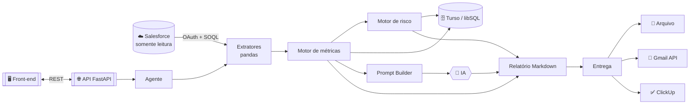
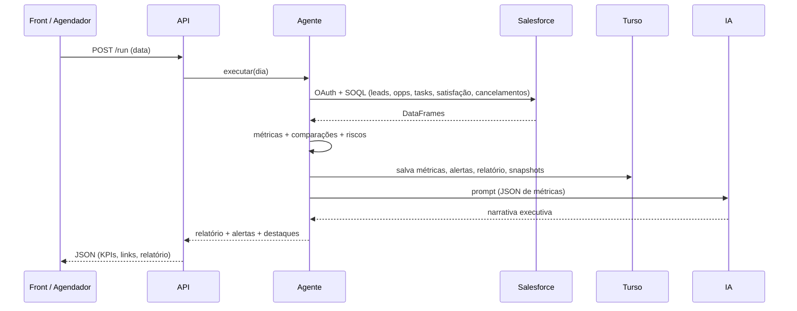

<!-- O bloco acima é o metadata do Hugging Face Spaces. Não remova ao publicar no HF. -->

<div align="center">


<br/><br/>


<!-- Badges dinâmicos: ajuste o caminho do repositório se o seu for diferente. -->


</div>

---

<div align="center">

### 🤖 Transforma dados do **Salesforce** em diagnóstico executivo diário, alertas de risco e ações recomendadas — com IA, banco Turso e entrega por e-mail e ClickUp.

</div>

> **Princípio central** &nbsp;·&nbsp; **Python calcula** · **IA interpreta** · **Turso armazena** · **Salesforce fornece os dados.**
> A IA **nunca** calcula indicadores — recebe um JSON com métricas prontas e produz a narrativa. O Salesforce opera em **modo somente leitura**.

## 🧭 Índice

<table>
<tr>
<td>

- [✨ Recursos](#-recursos)
- [🏗️ Arquitetura](#️-arquitetura)
- [🔄 Fluxo diário](#-fluxo-diário)
- [🧰 Stack](#-stack)

</td>
<td>

- [📁 Estrutura](#-estrutura-do-projeto)
- [⚙️ Configuração](#️-configuração-env)
- [🧩 Guia de replicação](#-guia-de-replicação)
- [▶️ Rodar local](#️-como-rodar-local)

</td>
<td>

- [🚀 Deploy (HF Spaces)](#-deploy-online-hugging-face-spaces)
- [🌐 API](#-api)
- [🖥️ Front-end](#️-front-end)
- [👨‍💻 Desenvolvedor](#-desenvolvedor)

</td>
</tr>
</table>

---

## ✨ Recursos

| | Recurso | Descrição |
|---|---------|-----------|
| 🔐 | **Autenticação** | Salesforce via OAuth Refresh Token (somente leitura) |
| 📈 | **Métricas** | Leads, oportunidades, tarefas, satisfação, cancelamentos + variações (dia anterior / média 7 dias) |
| 🚨 | **Motor de risco** | Alertas `low` / `medium` / `high` com ação recomendada |
| 🤖 | **IA** | Narrativa executiva (Hugging Face Inference · Ollama · Template) |
| 🗄️ | **Persistência** | Turso/libSQL — métricas, alertas, relatórios e snapshots |
| 📬 | **Entrega** | Arquivo `.md`, e-mail (Gmail API) e tarefas no ClickUp com links |
| 🌐 | **API + Front** | FastAPI + painel web multi-tela (lê o banco por GET) |

---

## 🏗️ Arquitetura



---

## 🔄 Fluxo diário



---

## 🧰 Stack

<div align="center">

&nbsp;&nbsp;&nbsp;
&nbsp;&nbsp;&nbsp;
&nbsp;&nbsp;&nbsp;
&nbsp;&nbsp;&nbsp;
&nbsp;&nbsp;&nbsp;
&nbsp;&nbsp;&nbsp;
&nbsp;&nbsp;&nbsp;
&nbsp;&nbsp;&nbsp;


</div>

---

## 📁 Estrutura do projeto

```
analytical-force/
├── api.py                 # API FastAPI (deploy online)
├── main.py                # CLI
├── frontend.html          # Painel web multi-tela (single-file)
├── Dockerfile             # Imagem para HF Spaces
├── requirements.txt       # Deps (local)  ·  requirements-hf.txt (Space)
├── .env.example           # Modelo de variáveis (sem segredos)
├── scripts/               # test_salesforce_oauth · test_gmail_oauth · clean_db
└── src/
    ├── config/   database/   salesforce/   analytics/
    ├── models/   agent/      delivery/     utils/
```

---

## ⚙️ Configuração (.env) 

Copie `.env.example` → `.env`. **Nunca** faça commit do `.env`.

| Variável | Descrição |
| -------- | --------- |
| `SALESFORCE_AUTH_MODE` | `oauth_refresh_token` (padrão) |
| `SALESFORCE_INSTANCE_URL` · `_CLIENT_ID` · `_CLIENT_SECRET` · `_REFRESH_TOKEN` | OAuth Salesforce |
| `TURSO_DATABASE_URL` · `TURSO_AUTH_TOKEN` | Banco libSQL/Turso |
| `MODEL_PROVIDER` | `hf_inference` · `ollama` · `transformers` · `template` |
| `HF_INFERENCE_MODEL` · `HF_TOKEN` | IA hospedada |
| `GMAIL_CLIENT_ID/SECRET/REFRESH_TOKEN/SENDER` | E-mail (Gmail API) |
| `CLICKUP_API_TOKEN` · `CLICKUP_LIST_ID` · `CLICKUP_ASSIGNEE_ID` | Tarefas |
| `OPPORTUNITY_MIN_AMOUNT` | Valor mínimo de oportunidade a analisar |

> Lista completa e comentada em [`.env.example`](.env.example).

---

## 🧩 Guia de replicação

<details>
<summary><b> &nbsp;1. Salesforce (OAuth Refresh Token)</b></summary>

1. **Setup → App Manager → New Connected App.**
2. Ative **Enable OAuth Settings**. Callback: `https://login.salesforce.com/services/oauth2/callback`.
3. Scopes: **`api`** e **`refresh_token, offline_access`**.
4. Copie **Consumer Key** (`CLIENT_ID`) e **Consumer Secret** (`CLIENT_SECRET`).
5. Gere o **Refresh Token** (fluxo OAuth) e preencha o `.env`.
6. Valide: `python scripts/test_salesforce_oauth.py`

> 💡 Use um **usuário de integração somente leitura**. O agente só faz `SELECT` (SOQL).
</details>

<details>
<summary><b> &nbsp;2. Turso (banco)</b></summary>

```bash
turso db create analytical-force
turso db show analytical-force --url      # -> TURSO_DATABASE_URL
turso db tokens create analytical-force   # -> TURSO_AUTH_TOKEN
```
As tabelas são criadas automaticamente (migrations idempotentes) na 1ª execução.
</details>

<details>
<summary><b> &nbsp;3. IA — Hugging Face Inference</b></summary>

1. Token em **huggingface.co/settings/tokens** com permissão **Make calls to Inference Providers**.
2. No `.env`: `MODEL_PROVIDER=hf_inference`, `HF_INFERENCE_MODEL=Qwen/Qwen2.5-7B-Instruct`, `HF_TOKEN=...`.

> Alternativas: `ollama` (local), `transformers` (CPU) ou `template` (sem IA, instantâneo).
</details>

<details>
<summary><b> &nbsp;4. Gmail API (e-mail)</b></summary>

> O HF Spaces bloqueia SMTP — por isso o e-mail online usa a **Gmail API (HTTP)**.

1. Google Cloud Console → ative a **Gmail API**.
2. Tela de consentimento (**External**) → adicione seu e-mail em **Test users**.
3. Credencial **OAuth Client (Web)** com redirect `https://developers.google.com/oauthplayground`.
4. No **OAuth Playground**, autorize `https://www.googleapis.com/auth/gmail.send` e gere o **refresh token**.
5. `.env`: `GMAIL_CLIENT_ID/SECRET/REFRESH_TOKEN` + `GMAIL_SENDER` + `REPORT_RECIPIENT_EMAIL`.
6. Valide: `python scripts/test_gmail_oauth.py`
</details>

<details>
<summary><b> &nbsp;5. ClickUp (tarefas)</b></summary>

1. ClickUp → **Settings → Apps → API Token** (`pk_...`).
2. **List ID** pela URL: `app.clickup.com/.../li/<LIST_ID>`.
3. `.env`: `CLICKUP_API_TOKEN`, `CLICKUP_LIST_ID`, `CLICKUP_ASSIGNEE_ID`, `ENABLE_CLICKUP_AUTO_CREATE=true`.
</details>

---

## ▶️ Como rodar (local)

```bash
python -m venv .venv && source .venv/bin/activate   # Windows: .venv\Scripts\activate
pip install -r requirements.txt
cp .env.example .env                                 # preencha

python main.py --check            # valida configuração
python main.py --date 2026-06-22  # executa o pipeline
uvicorn api:app --port 7860       # API + Swagger em /docs
```

Abra o **`frontend.html`** e aponte para a URL da API (aba **Configuração**).

---

## 🚀 Deploy online (Hugging Face Spaces)

Space tipo **Docker** (build leve). Em **Settings → Variables and secrets**:

| 🔒 Secrets | ⚙️ Variables |
| --------- | ----------- |
| `SALESFORCE_CLIENT_ID/SECRET/REFRESH_TOKEN` | `SALESFORCE_AUTH_MODE=oauth_refresh_token` |
| `TURSO_AUTH_TOKEN` · `HF_TOKEN` | `SALESFORCE_INSTANCE_URL` · `SALESFORCE_API_VERSION=64.0` |
| `GMAIL_*` · `CLICKUP_API_TOKEN` | `TURSO_DATABASE_URL` · `MODEL_PROVIDER=hf_inference` |
| `APP_API_TOKEN` (protege o `/run`) | `HF_INFERENCE_MODEL` · `CLICKUP_LIST_ID` … |

---

## 🌐 API

| Método | Rota | Descrição |
| ------ | ---- | --------- |
| `GET` | `/health` | Saúde |
| `GET` | `/config/check` | Validação (sem segredos) |
| `POST` | `/run` | Executa o pipeline |
| `GET` | `/run?date=` | Executa pelo navegador |
| `GET` | `/days` | Datas com relatório salvo |
| `GET` | `/day/{data}` | Todos os dados de um dia (do banco) |
| `GET` | `/metrics/{data}` | Métricas de um dia |
| `GET` | `/history?days=7` | Série histórica |
| `GET` | `/docs` | Swagger |

Header `X-API-Key` quando `APP_API_TOKEN` está definido.

---

## 🖥️ Front-end

`frontend.html` é um painel **multi-tela** (single-file): barra lateral, seletor de
dia que lê o banco por `GET /day`, tema claro/escuro, KPIs animados, filtro de
alertas, gráfico de severidade, **Registros do dia** com links ao Salesforce,
**Tendências** (histórico do Turso) e relatório em abas.

---

## 🗄️ Banco de dados

Tabelas (Turso/libSQL): `agent_runs`, `daily_metrics`, `daily_alerts`,
`daily_reports`, `salesforce_snapshots`, `object_mapping`, `agent_config`.
Gravações **idempotentes** por dia. Manutenção: `python scripts/clean_db.py --snapshots`.

---

## 🔒 Segurança

- Sem segredos no código (apenas `.env` / Secrets do Space).
- Salesforce **somente leitura** (apenas `SELECT`).
- Logs mascaram senhas/tokens · `/run` protegível por `APP_API_TOKEN`.

---

## 👨‍💻 Desenvolvedor

<div align="center">


### Vinicius de Souza Santos
**Criador e desenvolvedor do Analytical-Force**

[](https://github.com/ViniciusKhan)
[](https://huggingface.co/spaces/ViniciusKhan/analytical_force)

</div>


<div align="center"><sub>Feito com Python · Salesforce · Turso · Hugging Face &nbsp;·&nbsp; © Vinicius de Souza Santos</sub></div>
